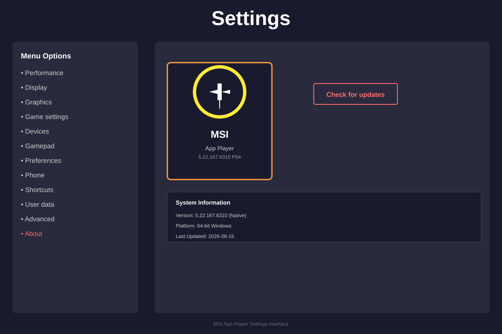
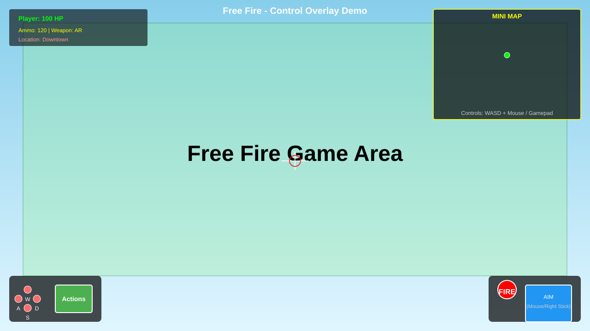
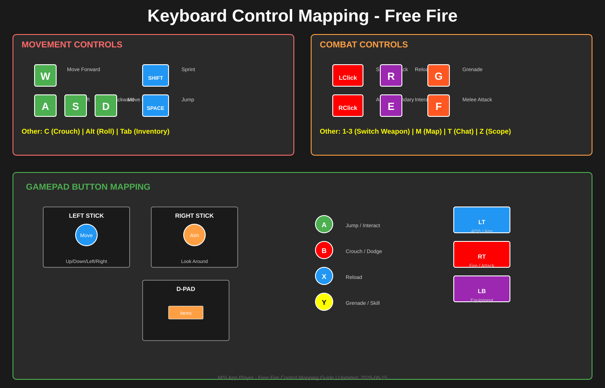

# MSI App Player - Free Fire & Mobile Games Emulator

Professional Android emulation platform with advanced game control configurations for popular mobile games.

## 📋 Overview

MSI App Player is a high-performance Android emulator optimized for gaming. This repository contains the official installer, game configurations, and control schemes for enhanced gameplay experience.

**Version:** 5.22.167.6310  
**Platform:** Windows (Native x64)  
**Last Updated:** 2026-08-15

---

## 🎮 Supported Games

- **Free Fire** - Battle Royale FPS with custom control mappings
- **PUBG Mobile** - Enhanced gaming performance
- **Call of Duty Mobile** - Optimized controls
- **Mobile Legends** - MOBA support
- **Genshin Impact** - Action RPG optimization
- And many more mobile games...

---

## 📁 Contents

### Core Files
- **BlueStacksMicroInstaller_5.22.167.6310_native.exe** - Official MSI App Player installer
- **com.dts.freefireth.cfg** - Free Fire game control configuration with keyboard and gamepad mappings
- **MSI-APP-Player.zip** - Complete application package

### Documentation
- **README.md** - This file
- **RELEASE_NOTES.md** - Version history and features
- **CHANGELOG.md** - Detailed changelog
- **CONTRIBUTING.md** - Contribution guidelines
- **LICENSE** - MIT License

### Resources
- **images/** - Screenshots and gameplay guides
  - msi-app-player-settings.png - Settings interface overview
  - [Additional game screenshots to be added]

---

## 🕹️ Game Control Features

### Free Fire Control Scheme (Standard - Edited)
The included configuration provides comprehensive control mappings:

**Movement Controls:**
- WASD - Character movement (Arrow keys alternative)
- Shift - Sprint/Run
- Space - Jump
- C - Crouch
- Alt - Roll/Sidestep

**Combat Controls:**
- Left Click / Pan Area - Aim and shoot
- Right Click - Fire weapon
- 2 - Weapon skill
- 3 - Weapon skill (with modifier)
- R - Reload
- Tab - Inventory/Backpack
- 5 - Equipment menu

**Additional Actions:**
- M - Map
- T - Team chat
- E - Interact
- F - Melee attack
- I - Inventory
- 1-9 - Quick actions
- G, H, J, K, N - Game specific actions
- Q - Ability/Special skill
- B - Firearm mode toggle
- CapsLock - Weapon scope action
- Z - Quick action script

**Gamepad Support:**
- Full Xbox controller compatibility
- Right stick for aiming
- Left stick for movement
- Shoulder buttons for abilities
- D-pad for item selection

---

## 🚀 Getting Started

### Installation

1. **Clone the repository:**
```bash
git clone https://github.com/surjolive/msi.git
cd msi
```

2. **Extract the installer:**
```bash
unzip MSI-APP-Player.zip
```

3. **Run the installer:**
```bash
extracted/BlueStacksMicroInstaller_5.22.167.6310_native.exe
```

4. **Follow the installation wizard:**
   - Accept terms and conditions
   - Choose installation path
   - Select gaming optimizations
   - Complete setup

### Configuration Setup

1. **Import game controls:**
   - Open MSI App Player
   - Navigate to Settings → Gamepad
   - Import `com.dts.freefireth.cfg`
   - Adjust sensitivity and layout as needed

2. **Performance Optimization:**
   - Settings → Performance
   - RAM allocation: 4GB+ recommended
   - CPU cores: 4+ cores recommended
   - Enable GPU acceleration

3. **Display Settings:**
   - Resolution: 1280x720 or higher
   - Graphics: High/Ultra for best experience
   - Refresh rate: 60FPS+

---

## ⚙️ Configuration Details

### com.dts.freefireth.cfg Structure

```json
{
  "MetaData": {
    "ParserVersion": "17",
    "UpdateVersion": "3",
    "CloudUpdateTimeUTC": "2026-06-24 18:37:55"
  },
  "ControlSchemes": [
    {
      "Name": "Standard (Edited)",
      "Selected": true,
      "GameControls": [
        // Keyboard mappings
        // Gamepad mappings
        // Script actions
      ]
    }
  ],
  "Strings": {
    // Multi-language support (16+ languages)
  }
}
```

### Supported Languages
- English, German, Spanish, French, Italian
- Japanese, Korean, Polish, Portuguese (Brazil)
- Russian, Thai, Turkish, Vietnamese, Chinese (Traditional)
- And more...

---

## 📸 Screenshots & Resources

### MSI App Player Settings Interface

*Professional settings interface showing Performance, Display, Graphics, Gamepad, and other configuration options*

### Free Fire Control Overlay & Gameplay

*Real-time gameplay overlay showing movement controls (WASD), combat controls (Fire/Aim), and status information*

### Keyboard & Gamepad Mapping Guide

*Complete control mapping reference for keyboard keys and gamepad buttons with color-coded functions*

### Quick Reference
- **Movement Controls:** WASD (or Arrow keys) + Shift (Sprint), Space (Jump), C (Crouch)
- **Combat Controls:** Left Click (Shoot), Right Click (Aim), R (Reload), G (Grenade), E (Skill)
- **Gamepad Controls:** Full Xbox controller support with Left Stick (Move), Right Stick (Aim), RT (Fire), LT (ADS)
- **See:** [GAME_CONTROLS.md](GAME_CONTROLS.md) for detailed function reference
- **See:** [GAME_CONFIGS.md](GAME_CONFIGS.md) for game-specific configurations

---

## 🎯 Features

### Performance
- ✅ Native 64-bit processor support
- ✅ Multi-core optimization
- ✅ GPU acceleration
- ✅ Memory-efficient emulation
- ✅ Smooth 60+ FPS gameplay

### Gaming
- ✅ Dual-mode control (Keyboard + Gamepad)
- ✅ Customizable control schemes
- ✅ Macro support
- ✅ Multiple game profiles
- ✅ Real-time performance monitoring

### Accessibility
- ✅ Multi-language interface
- ✅ Customizable keyboard layouts
- ✅ Adjustable sensitivity settings
- ✅ Visual calibration tools
- ✅ Accessibility options

---

## 📝 Usage Examples

### Launching Free Fire with Optimal Settings
```bash
# 1. Open MSI App Player
# 2. Select Free Fire from app store
# 3. Load "Standard (Edited)" control scheme
# 4. Adjust display to 1280x720
# 5. Enable performance mode
# 6. Launch game
```

### Customizing Controls
```bash
# Navigate to: Settings → Gamepad → Edit Scheme
# Modify key bindings as needed
# Save custom scheme
# Apply to Free Fire
```

### Multiple Game Support
Create separate control schemes for:
- Free Fire
- PUBG Mobile
- Call of Duty Mobile
- Other compatible games

---

## 🔧 Advanced Configuration

### System Requirements
- **OS:** Windows 7 or higher
- **CPU:** Intel/AMD processor with virtualization support
- **RAM:** 4GB minimum (8GB+ recommended)
- **Storage:** 5GB free space
- **GPU:** 1GB dedicated VRAM or Intel HD Graphics

### Network Requirements
- High-speed internet connection
- Stable ping (< 100ms recommended)
- UDP port access for gaming

### Keyboard Layout Support
- US (English)
- UK (English)
- India (Localized)
- Custom layouts supported

---

## 📊 Configuration Statistics

**Control Scheme Breakdown:**
- D-Pad Control: 1
- Pan/Camera Control: 1
- Tap Actions: 20+
- Scripts: 3
- Repeat Actions: 3
- Total Key Bindings: 25+

**Language Support:** 16+  
**Gamepad Profiles:** Multiple presets  
**Customization Options:** 100+

---

## 🐛 Troubleshooting

### Performance Issues
1. Increase RAM allocation in settings
2. Reduce graphics quality
3. Close background applications
4. Update GPU drivers

### Control Issues
1. Verify keyboard layout selection
2. Recalibrate gamepad in settings
3. Check for conflicting key bindings
4. Reset to default scheme and reconfigure

### Installation Problems
1. Run installer as administrator
2. Disable antivirus temporarily
3. Check Windows Defender exclusions
4. Ensure sufficient disk space

---

## 📚 Documentation

- [RELEASE_NOTES.md](RELEASE_NOTES.md) - Version details and features
- [CHANGELOG.md](CHANGELOG.md) - Complete changelog
- [CONTRIBUTING.md](CONTRIBUTING.md) - How to contribute
- [LICENSE](LICENSE) - MIT License terms

---

## 🤝 Contributing

Contributions are welcome! Please read [CONTRIBUTING.md](CONTRIBUTING.md) for guidelines on:
- Reporting bugs
- Suggesting features
- Submitting control scheme improvements
- Documentation improvements

---

## 📞 Support & Contact

- **GitHub Issues:** [Report bugs here](https://github.com/surjolive/msi/issues)
- **Discussions:** [Community discussions](https://github.com/surjolive/msi/discussions)
- **Repository:** https://github.com/surjolive/msi

---

## 📜 License

This project is licensed under the MIT License - see [LICENSE](LICENSE) file for details.

---

## ⭐ Repository Status

- **Latest Version:** v5.22.167.6310
- **Status:** Active & Maintained
- **Last Update:** 2026-08-15
- **Contributors:** Open for contributions

**Give us a ⭐ if you find this project helpful!**

---

## 🎓 Learning Resources

### Getting Started
1. Install MSI App Player
2. Import Free Fire configuration
3. Launch a practice game
4. Customize controls to your preference
5. Master the game!

### Advanced Tips
- Use macros for complex actions
- Create game-specific profiles
- Monitor performance metrics
- Join community discussions

---

*Last updated: August 15, 2026*  
*MSI App Player - Professional Gaming Emulation Platform*
